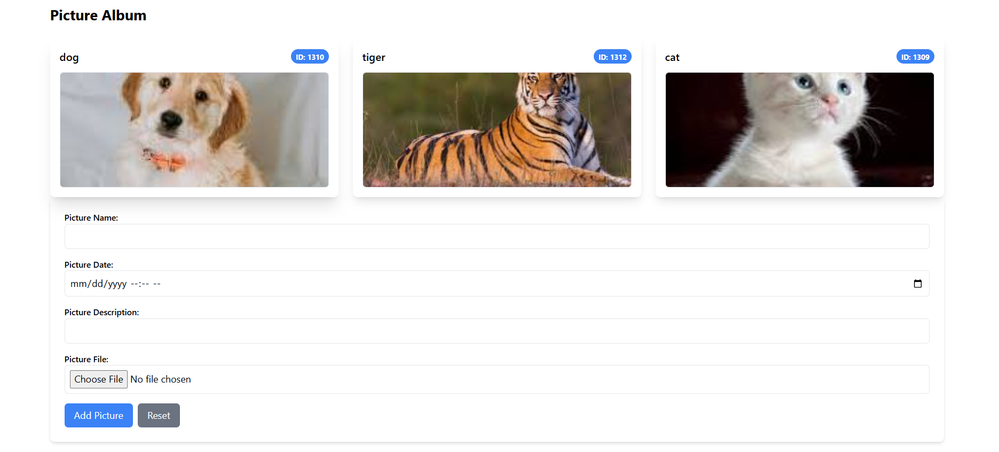

# PictureAlbum API

## Overview
The **PictureAlbum API** is a full-stack web application that allows users to upload, manage, and retrieve images with metadata. It features a **React-based SPA frontend** and a **RESTful ASP.NET Core WebAPI backend**, integrating **SQL Server** for database storage.

## Features
- **File Upload**: Upload images with metadata (date, description, and name validation).
- **File Retrieval**: Fetch paginated lists of stored files or retrieve all files at once.
- **Client-Side State Management**: Utilizes **Zustand** for smooth state handling and pagination.
- **Security**: Implements input validation and secure file handling.
- **Database Integration**: Uses **Entity Framework Core** for seamless data interaction.
- **Testing**:
  - **Backend**: Unit testing implemented with **XUnit** and **Moq**.
  - **Frontend**: Component testing implemented with **Jest** and **React Testing Library**.

## Technologies Used
### Backend
- **ASP.NET Core 7.0+**
- **Entity Framework Core**
- **SQL Server**
- **Moq & XUnit** (for unit testing)

### Frontend
- **React (TypeScript)**
- **Zustand** (state management)
- **Tailwind CSS** (styling)
- **Jest & React Testing Library** (testing)

---

## System Architecture
```
Frontend (React)  <->  Backend (ASP.NET Core WebAPI)  <->  Database (SQL Server)
```
- The **React frontend** interacts with the **ASP.NET Core WebAPI**, which serves as the backend.
- The **backend** processes requests, performs business logic, and interacts with **SQL Server** via **Entity Framework Core**.
- **Files** are stored in the database as binary content.

---

## Installation & Setup
### Prerequisites
- .NET 7.0 or later
- SQL Server
- Visual Studio / VS Code
- Node.js & npm (for frontend setup)

### Backend Setup
#### Clone the Repository
```sh
git clone https://github.com/your-repo/picture-album-api.git
cd picture-album-api
```

#### Configure Database Connection
Modify `appsettings.json` with your database connection string:
```json
"ConnectionStrings": {
  "DefaultConnection": "Server=your_server;Database=PictureAlbumDb;User Id=your_user;Password=your_password;"
}
```

#### Apply Migrations
```sh
dotnet ef database update
```

#### Run the API
```sh
dotnet run
```
The API will be available at `http://localhost:5000/api/files`.

### Frontend Setup
```sh
cd frontend
npm install
npm start
```
The frontend will be available at `http://localhost:3000`.

---

## Database Schema
The database includes a `Files` table for storing file metadata and binary content.
```sql
CREATE TABLE [dbo].[Files](
  [Id] [int] IDENTITY(1,1) NOT NULL,
  [Name] [nvarchar](255) NOT NULL,
  [FileSize] [bigint] NOT NULL,
  [UploadDate] [datetime] NULL DEFAULT (getdate()),
  [Description] [nvarchar](250) NULL,
  [FileContent] [varbinary](max) NOT NULL,
  PRIMARY KEY ([Id])
);
```

---

## API Endpoints
### Upload File
**POST** `/api/files/upload`
#### Request (multipart/form-data)
| Parameter        | Type     | Description                      |
|-----------------|----------|----------------------------------|
| File            | `IFormFile` | The uploaded file              |
| fileName        | `string` | User-defined file name          |
| fileDate        | `string` (optional) | File date (YYYY-MM-DD) |
| fileDescription | `string` (optional) | File description       |

### Get Files (Paginated)
**GET** `/api/files?page=1&pageSize=10`

### Get All Files
**GET** `/api/files/all`

---

## Frontend Overview
### State Management
- Uses **Zustand** for managing the file list and pagination.
- Fetches files from the API and updates the store.

### Pagination
- Implements **infinite scrolling**.
- Fetches additional pages only when required.

### Components
#### `FileForm.tsx`
- Handles file upload.
- Uses client-side validation before sending requests.

#### `FileItem.tsx`
- Displays file details including **name, description, and preview**.

#### `HomePage.tsx`
- Fetches files using `useFilesStore`.
- Displays the list of uploaded files with **lazy loading**.

---

## Testing
### Backend
Run unit tests with:
```sh
dotnet test
```

### Frontend
Run Jest tests with:
```sh
npm test
```
#### Example Test Cases
- **FileForm Component**
  - Renders the form correctly.
  - Allows users to input file details.
  - Displays an error if the file is missing.
- **FileItem Component**
  - Displays file details correctly.
  - Loads and renders images properly.

---

## Deployment
### Backend Deployment (Azure / AWS / DigitalOcean)
1. Publish the API
   ```sh
   dotnet publish -c Release -o out
   ```
2. Deploy using **Docker** (if needed)
   ```sh
   docker build -t picture-album-api .
   docker run -p 5000:5000 picture-album-api
   ```
3. Configure **Azure App Service** / **AWS Elastic Beanstalk** for hosting.

### Frontend Deployment (Vercel / Netlify)
1. Build the project:
   ```sh
   npm run build
   ```
2. Deploy to Vercel:
   ```sh
   vercel --prod
   ```
3. Configure API URL in `.env` file before deploying.

---

## Best Practices Implemented
✅ **Separation of Concerns (SoC):** Clear distinction between frontend, backend, and database logic.
✅ **SOLID Principles:** Applied in backend architecture for maintainability.
✅ **Error Handling:** Detailed error responses for API failures.
✅ **Security Considerations:** Prevents SQL injection and validates file uploads.

---

## Screenshots


---

## Author
**Tal - Full Stack Developer**

